# MMO Expo

## Table of Contents
1. [Introduction](#Introduction)
   - [Features](#Features)
2. [Using Web App](#Using-Web-App)
   - [Starting the WebGL Web App](#Starting-the-WebGL-Web-App)
   - [Creating Event](#Creating-Event)
   - [Joining Event](#Joining-Event)
   - [Controls](#Controls)
   - [View Users in Event](#View-Users-in-Event)
   - [Chat System](#Chat-System)
   - [Navigating Event](#Navigating-Event)
   - [Booths](#Booths)
   - [Event Information Booths](#Event-Information-Booths)
   - [Leaving Event](#Leaving-Event)
3. [Project Setup](#Project-Setup)
   - [Unity Version](#Unity-Version)
   - [Project Installation](#Project-Installation)
   - [Photon Setup](#Photon-Setup)
   - [Running Project in Unity Editor](#Running-Project-in-Unity-Editor)
   - [Building Project in WebGL](#Building-Project-in-WebGL)
   - [Code Coverage Unity Package Installation](#Code-Coverage-Unity-Package-Installation)
   - [Linter](#Linter)
4. [Systems Overview](#Systems-Overview)
   - [Event Launch](#Event-Launch)
   - [User Setup](#User-Setup)
   - [Panel System](#Panel-System)
   - [Chat System](#Chat-System)
   - [Movement System](#Movement-System)
   - [Player List Menu](#Player-List-Menu)
5. [References](#References)

## Introduction
This project is to implement a 3D, web-hosted, massively multiplayer online (**MMO**) experience for OSU students to showcase their project posters using Unity Engine and Photon Engine. Hundreds of students will be able to log in using an URL and a passcode where they can pick an avatar of their choosing, explore a convention-like event with multiple exhibition halls, and also chat with each other through multiple chat channels.

### Features
- [x] First-person 3D navigation
- [x] Chat system
- [x] User avatars
- [x] Teleportation system
- [x] Student booths
- [x] Event information booths
- [x] Event passcodes

## Using Web App

### Starting the WebGL Web App
1. [GitHub Pages](https://validus00.github.io/mmo-expo/) link provided to users will open up the application in a web browser.
2. There is a blue button located to the bottom right of the application that can be used to full-screen the application. Press `Esc` to exit full screen mode.

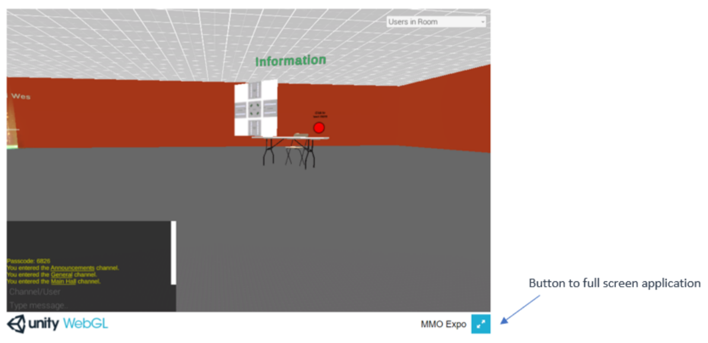

### Creating Event
1. A user can create a room by clicking on the **Create New Event** button located on the initial screen displayed after applicated is loaded.
2. The passcode for the event that was just created is displayed at the top of the chat box when the user is loaded into the event and it is also available in the exit menu. Note that this passcode is required for other users to join the event.

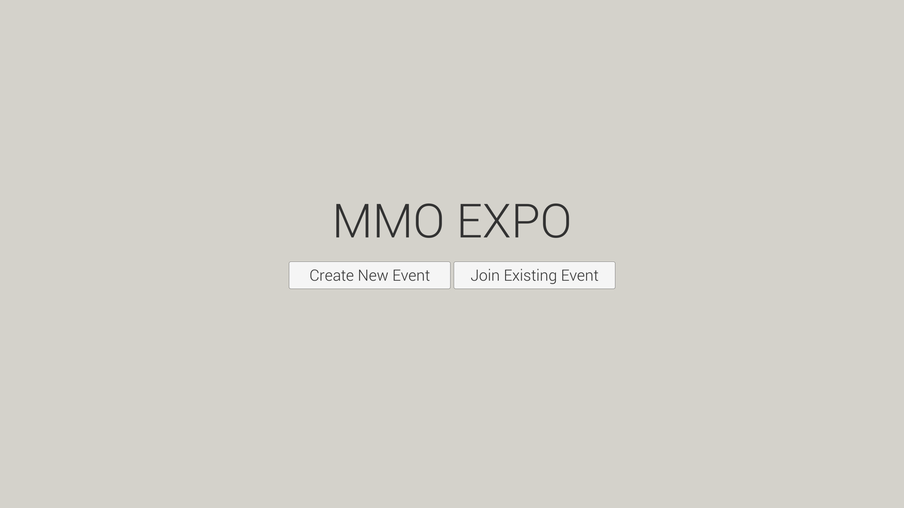

### Joining Event
- Two ways (depending on the user type)
  - A designated user is to create an event and provide a passcode to all other users that will be joining the event. The passcode will appear on top of the chat messages when logging into event.
  - All users that are not creating, but joining the event will use the provided passcode to enter the same event.
- After joining/creating an event, user will be presented with option to customize name and avatar.
  - Note that name cannot be a duplicate of one that is already in the event.
  - Name and avatar are both required information before being allowed to enter the event.

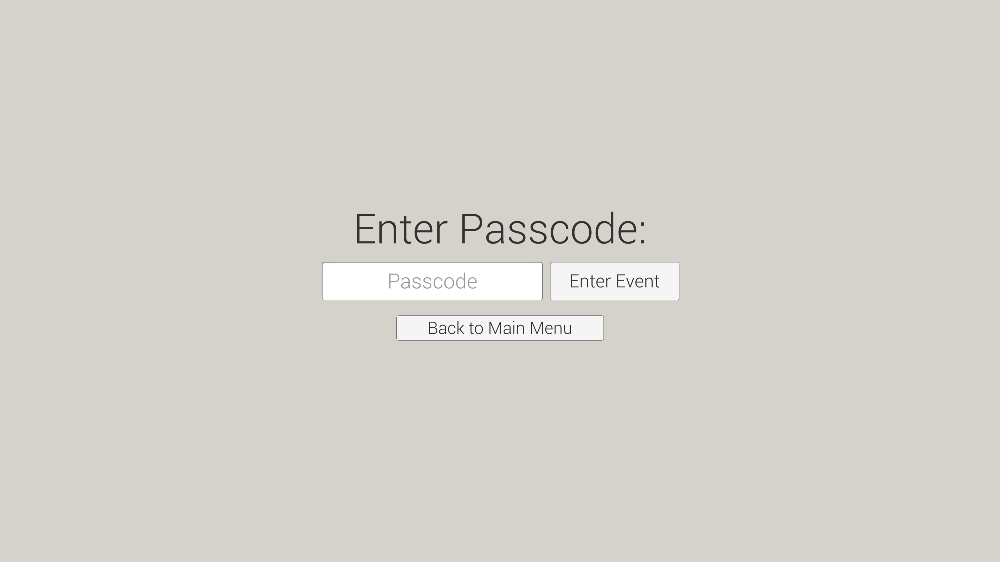
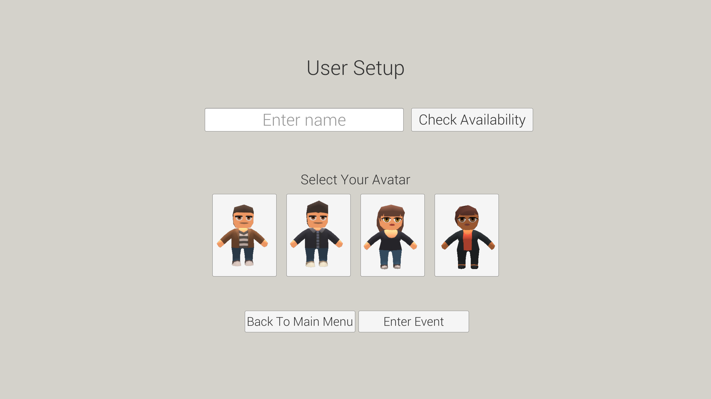

### Controls
- WASD keys for movement
  - `W` - Move forward
  - `D` - Move right
  - `S` - Move backward
  - `A` - Move left
- Hold right mouse button to rotate camera.
- Press `Tab` when booth form panel is not active will bring up the exit event menu.
- If in full screen, press `Esc` to exit full screen.
- Note that controls are also able for viewing in the exit menu.

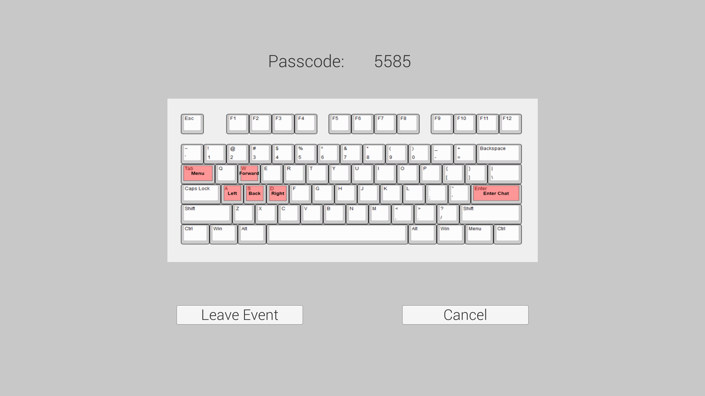

### View Users in Event
- A list of users currently logged into the event can be viewed in the dropdown located at the top right of the screen 
- User can select someone in the dropdown list to private message them
  - The channel/user input field in the chat box will be populated on click
- Note that selecting yourself in the list will not do anything

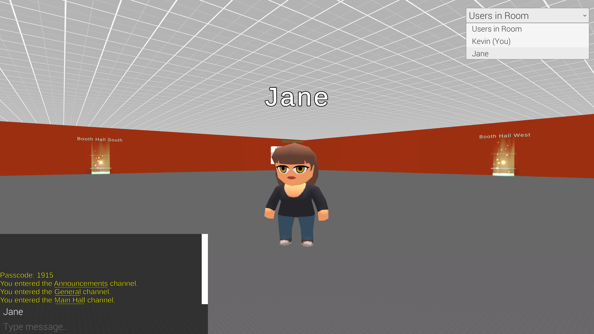

### Chat System
- Chat controls/information
  - Enter channel name or another user’s name in the first input field of the chat box.
  - Enter message in the second input field of the chat box.
  - Press `Enter` to submit message.
- Static public chat
  - These are channels anyone can participate in no matter the location.
  - Available public channels: General, Announcements
- Proximity public chat
  - A user can join a hall's chat channel once they enter that hall.
  - A user is subscribed to an occupied booth’s chat channel if they are within a certain radius of the booth.
  - The subscribed booth’s channel name must be specified in the chat box to participate.
- Private chat
  - A user can privately message another user as long as the name is valid and the user is in the event
  - A user cannot send private messages to themselves
  - Note that selecting a user from the room list (**Users in Room** dropdown) can also populate the channel/user input field for private messaging

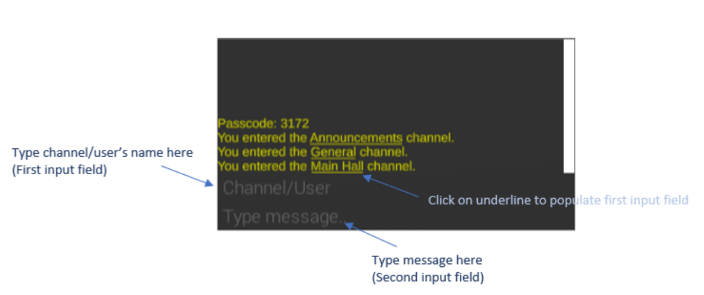

### Navigating Event
- Everyone spawns in the **Main Hall**
- There are 4 halls for student booths placed in relative locations of the main hall
  - Booth Hall North
  - Booth Hall West
  - Booth Hall East
  - Booth Hall South
- Each booth hall has 10 booths
- There is a labeled portal to teleport to each booth hall
- Each booth hall has a portal to teleport the user back to the main hall
- To use a portal and to teleport to a booth hall or main hall, walk up to the portal to trigger the teleporting event

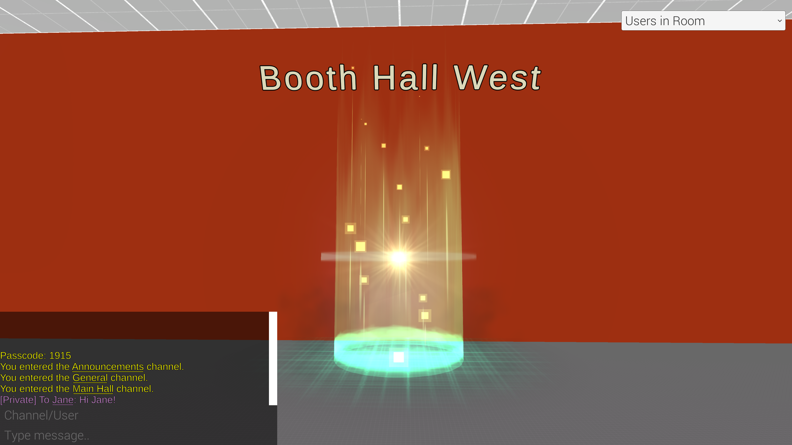

### Booths
- Occupying a booth
  - When a booth is unoccupied, clicking on the red **Click to learn more** button will bring up the booth form panel for project teams to fill out their booth information
  - The booth form panel allows a team to enter: team name, project name, project URL, optional poster image URL, and project description. Poster image URL must contain **access-control-allow-origin: \*** header because WebGL does not allow cross-origin resource sharing for security purposes. You can use images from imgur.com since image responses from there contain the aforementioned header. Feel free to use [our poster image](https://i.imgur.com/jrU8lab.png) on imgur.

- Viewing a booth
  - If a booth is occupied, then clicking on the red button will bring up the booth information panel, where users can click to open a browser window to the project website

- Un-occupying a booth
  - If the owner of the booth clicks on the booth information panel, they will see a button to reset the booth information. Clicking on this optional button will reset the booth to being unoccupied

- Q&A sessions
  - Proximity chat for an occupied booth can be used to hold Q&A sessions or to interact with users who are interested in the project or users who created the project

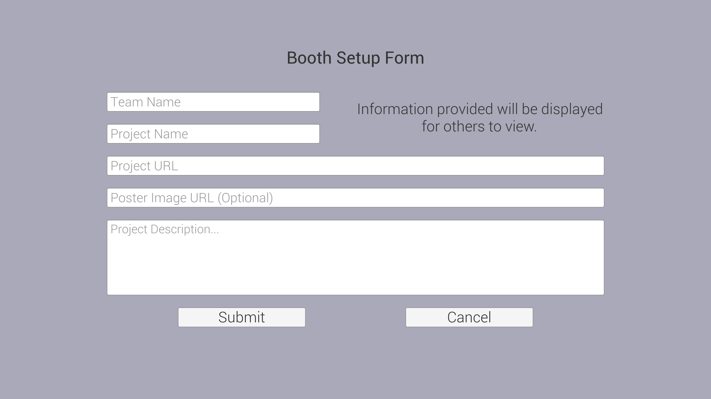
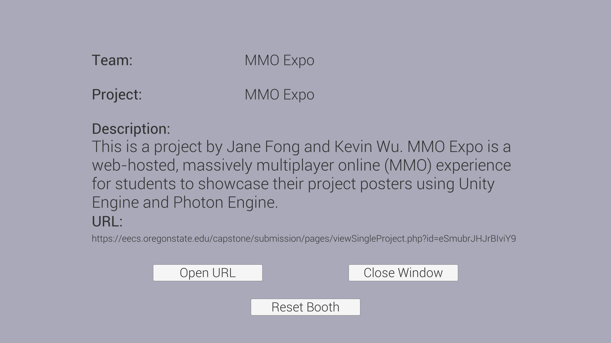

### Event Information Booths
- Setting up event information booths
  - Click on the red **Click to learn more** button to fill out the event information.
  - The event information form panel allows an admin to enter: Event info URL, Schedule URL, and Zoom URL.

- View event information
  - After event information is set up, clicking on the red button will bring up the event information panel, where users can click to open links to external websites.

- Resetting event information
  - If the admin clicks on the event information panel, they will see a button to reset the event information. Clicking on this optional button will reset the event information so that it can be entered again.

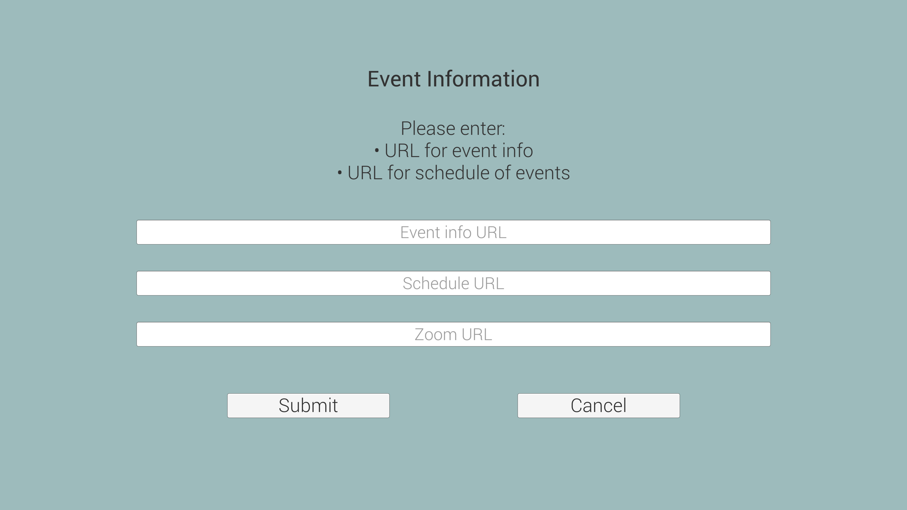
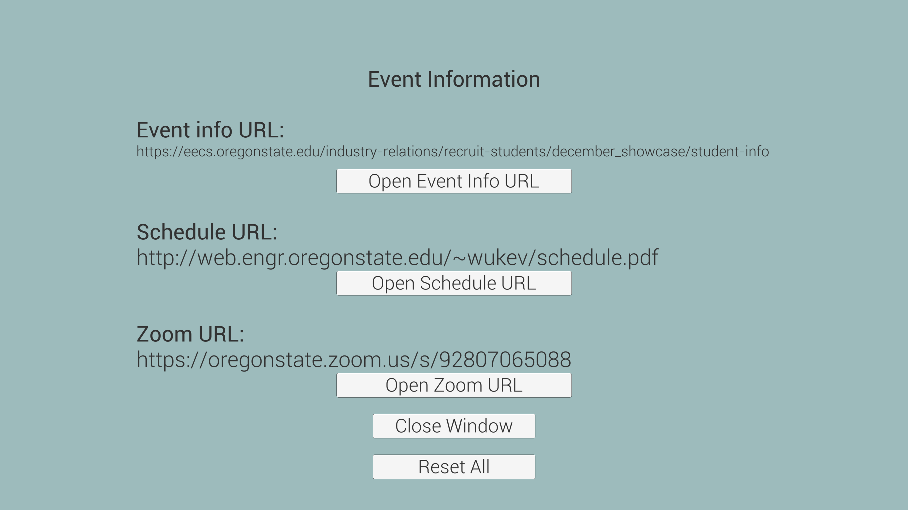

### Leaving Event
- If a user wants to leave the event and go back to the initial application screen, they can press `Tab` to access the menu and click on the **Leave Event** button
  - This will take the user back to the initial menu on application load
- User can also refresh the browser page to access the initial menu
- User can close the browser window to close application entirely

## Project Setup

### Unity Version
This project has been developed and tested to run in [Unity 2019.4.17f1](https://unity3d.com/get-unity/download/archive).

### Project Installation
1. After Unity Hub is installed, run Unity Hub, click the **ADD** button in the **Projects** tab and find the folder that contains the project files. Note that Unity Hub also includes Unity itself.
2. After **mmo-expo** has been added to the list of Projects, click on **mmo-expo** to open the Unity Editor and to import the required packages for this project.

### Photon Setup
1. Go to [Photon](https://www.photonengine.com/) and sign up for a new free account.
2. Go to [Dashboard](https://dashboard.photonengine.com/).
3. You will need to create two apps: **Photon Chat** and **PUN**.
4. Fill out the **Create a New Application** forms, especially the **Photon Type** (*Photon Chat*, *Photon PUN*), and the **Name**, for both apps.
5. Go back to your project on Unity Editor and go to: **Window menu** → **Photon Unity Networking** → **PUN Wizard** → click on **Locate PhotonServerSettings**.
6. Open **PhotonServerSettings.asset**, find your **Inspector** Unity window, fill out **App Id PUN** and **App Id Chat** using the **App ID:** field in your Photon Dashboard for your Photon Chat app and Photon PUN app.
7. At this point, when you run the project, it should automatically connect to Photon's services.

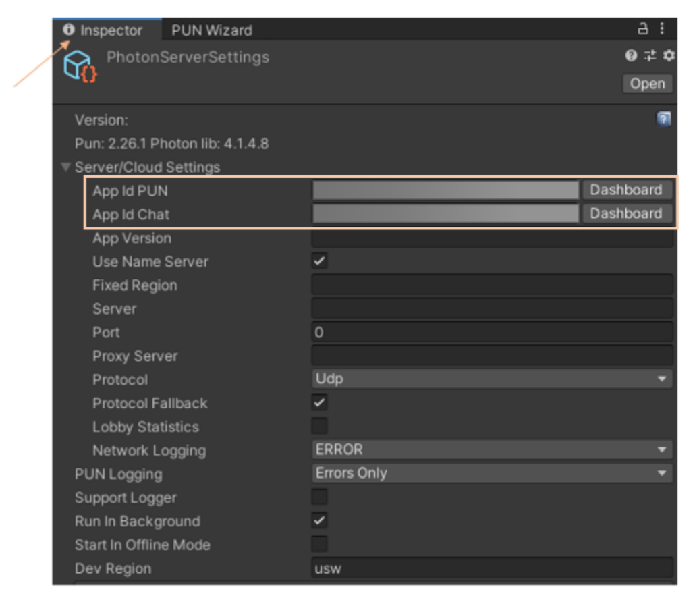

### Running Project in Unity Editor
1. In the **Project** Unity window, open **Assets** folder → **Scenes** folder → open **MainEventScene**, then open **EventLauncherScene**.
2. Click **Play** button in the top middle of the editor and it should start running the project. Make sure that **EventLauncherScene** is shown in the **Hierarchy** Unity window. If it is not, then open **EventLauncherScene** again. Make sure that EventLauncherScene is shown in the Hierarchy Unity window. If it is not, then open EventLauncherScene again.
3. Once you are done, click the **Play** button again in the top middle of the editor to stop running the project.

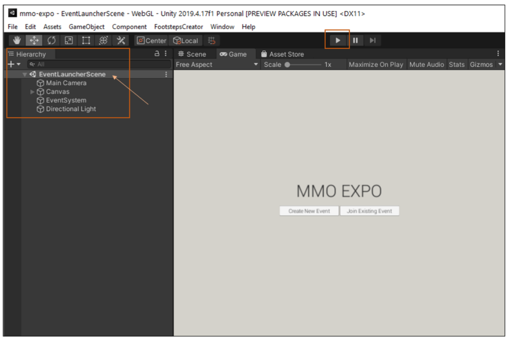

### Building Project in WebGL
1. **File** menu → **Build Settings**, or `Ctrl + Shift + B` to open the build menu.
2. Click on **Add Open Scenes**, click on the boxes for `Scenes/EventLauncherScene` and `Scenes/MainEventScene` to check them.
3. Under Platform, click on **WebGL**, then click on **Build And Run**. If it is greyed out, then click on **Switch Platform** first, before clicking on **Build And Run**.
4. After clicking on **Build And Run**, select a folder where you want your WebGL program files to be build in. You can create a folder called **Build** first.
5. It will start the process of building all of WebGL files needed to run the program. This will take around six minutes.
6. Since we are using [kou-yeung's Unity package](https://github.com/kou-yeung/WebGLInput) for copy and pasting in input fields in WebGL, we have to follow [these instructions](https://github.com/kou-yeung/WebGLInput/wiki/Support-FullScreen). Open up `index.html` in a text/code editor and replace:
```
<div class="fullscreen" onclick="gameInstance.SetFullscreen(1)"></div>
```
↓
```
<div class="fullscreen" onclick="document.makeFullscreen('unityContainer')"></div>
```
7. To run this WebGL page locally, you can follow [these instructions](https://www.youtube.com/watch?v=Mdi-5I8fDM0) using Mozilla Firefox.
8. In order to let others run the program, you have to host these WebGL files as a static webpage somewhere, like GitHub Pages for example.

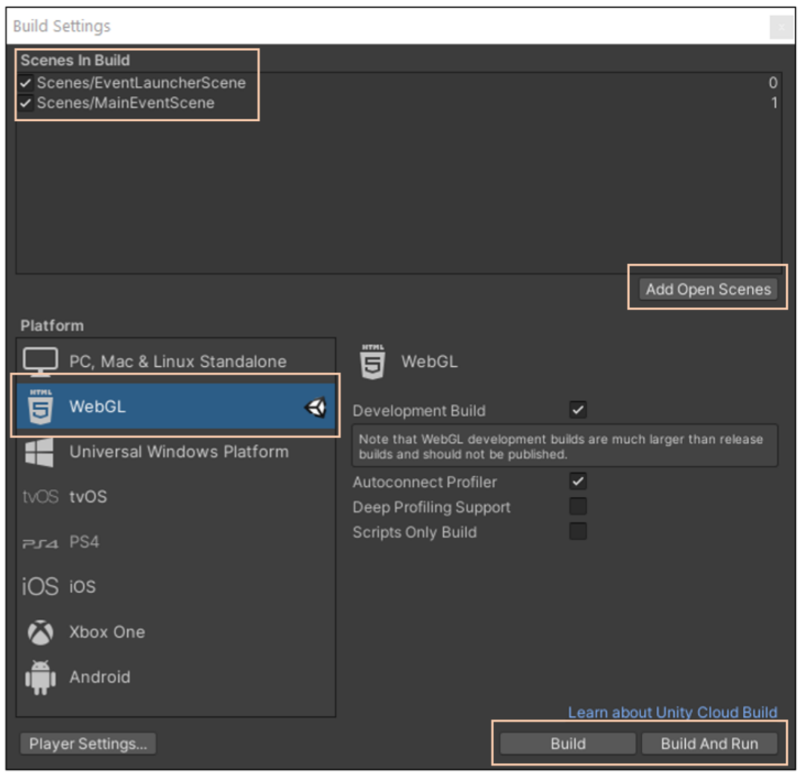

### Code Coverage Unity Package Installation
1. In order to run Code Coverage, download the code coverage Unity package by going to: **Window** menu → **Package Manager**
2. Let the Package Manager menu load, then click on **Code Coverage** and select **preview - 0.2.2-preview** and then install it.
3. After Code Coverage package is installed, enable code coverage by going to: **Edit** menu → **Preferences** → **General** tab in the new window, and then click on **Enable Code Coverage**.
4. Code coverage will be enabled once you restart the Unity Editor.
5. To see the code coverage from the unit tests, go to: **Window** menu → **General** → **Code Coverage**, and then in the new window check all of the boxes.
6. Run the unit test suite by going to: **Window** menu → **General** → **Test Runner**, and then in the new window click on **Run All**. This will run all of the unit tests and also generate the code coverage report and open a new folder showing where these reports are.
7. To see the code coverage report, click on any of the `Scripts_XXXXX.htm` files.

### Linter
- We use **dotnet-format** as a linter and use `.editorconfig` file from Roslyn code style with some modifications based on team preferences.
- dotnet-format is installed with this command:
```
dotnet tool install -g dotnet-format
```
- In addition, we use **StyleCop**, a Microsoft open-source code analysis tool that is available as a Visual Studio extension, as a linter within VS IDE.

## Systems Overview

### Event Launch
- This handles all logic related to establishing connection to Photon Cloud via PUN 2 APIs, creating or joining events, and validating passcodes.
- Class:
  - LaunchManager

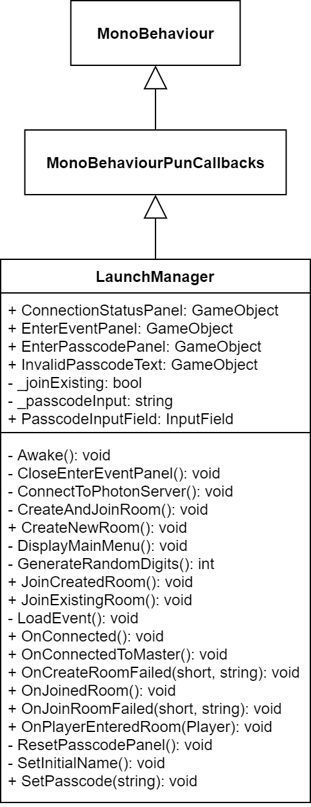

### User Setup
- This handles username validation, user avatar selection, user instantiation, and user exit.
- Classes:
  - AvatarEventManager
  - ExpoEventManager
  - PlayerNameInputManager
  - UserSetup

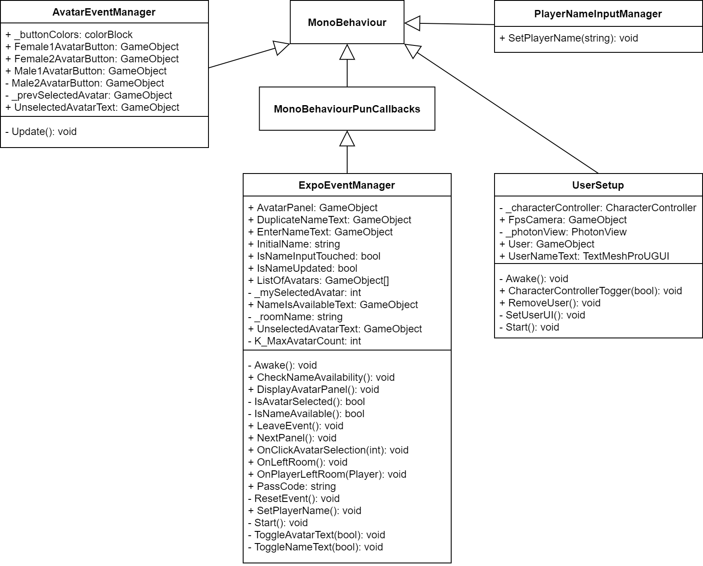

### Panel System
- This handles the majority of logic related to panels in the main event scene, such as opening and closing of UI elements, displaying error messages and handling input fields. It also handles booth setup logic, including joining booth specific chat channels, and handles event information setup logic.
- Classes:
  - BoothSetup
  - ChatManager
  - EventInfoManager
  - ExpoEventManager
  - PanelManager

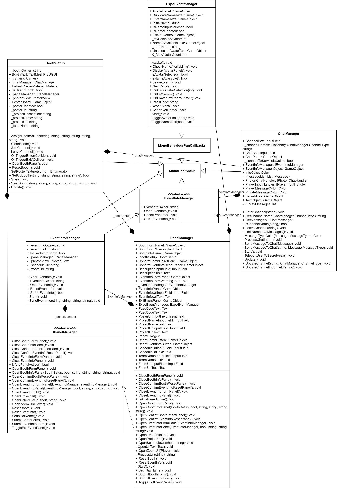

### Chat System
- This handles all chat-related logic, such as establishing connection to Photon Chat, handling public messages and private messages, joining and leaving chat channels, and handling chat input fields.
- Classes:
  - ChatManager
  - Message
  - PhotonChatHandler
  - PlayerInputHandler

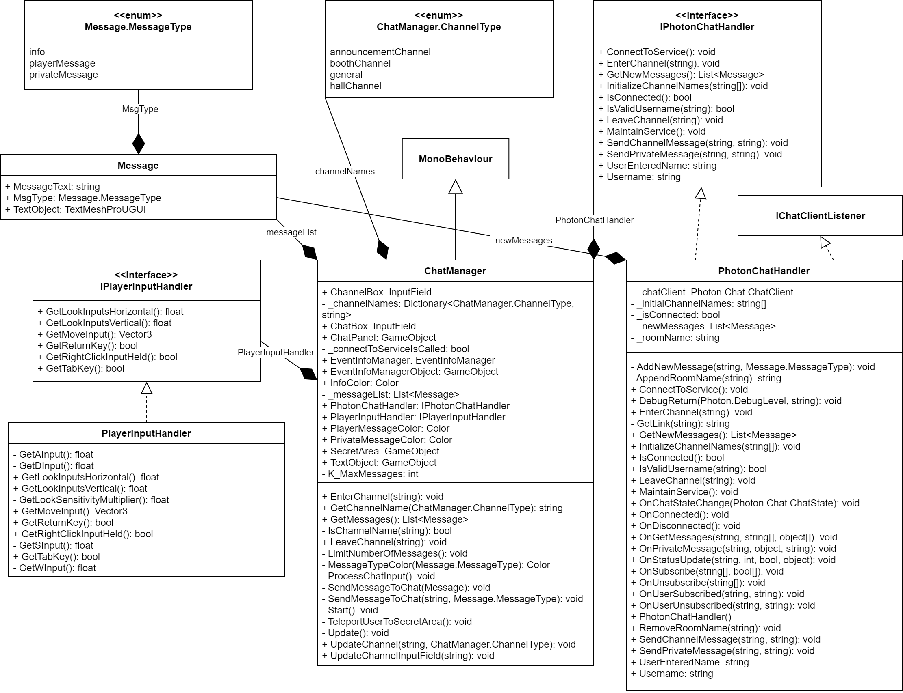

### Movement System
- This handles user movement and keyboard input logic, such as keyboard and mouse controls. It depends on IPanelManager to determine whether panels currently are open or closed.
- Classes:
  - IInputFieldHandler
  - MovementController
  - PanelManager
  - PlayerInputHandler

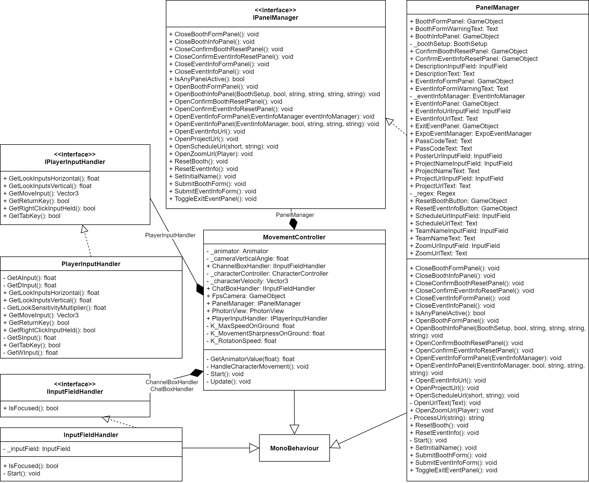

### Player List Menu
- This handles the player list menu that displays the current users in the event.
- Classes:
  - ChatManager
  - RoomListManager

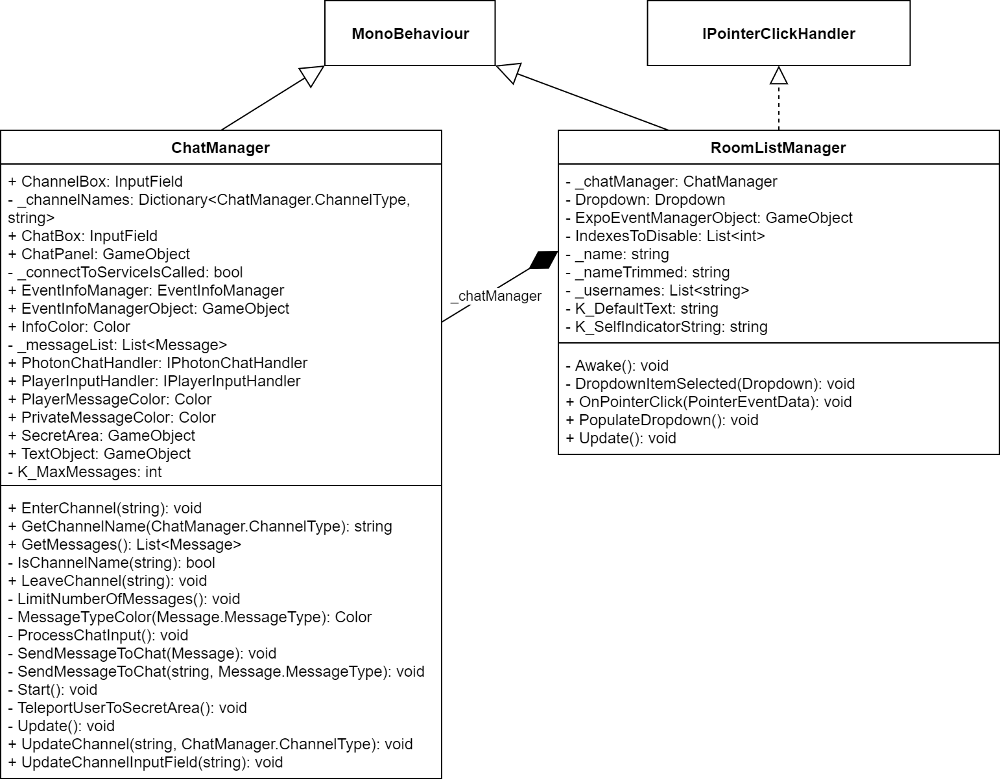

## References
- Code References
  - https://docs.unity3d.com/Manual/index.html
  - https://doc.photonengine.com/en-us/chat/current/getting-started/chat-intro
  - https://doc.photonengine.com/en-us/pun/v2/demos-and-tutorials/pun-basics-tutorial/intro
  - https://forum.unity.com/threads/changing-ui-button-color-c-solved.287264/
  - https://forum.unity.com/threads/changing-the-color-of-a-button-in-script.344121/
  - https://answers.unity.com/questions/918669/how-to-get-ui-button-to-stay-in-a-pressed-state.html
  - https://gamedev.stackexchange.com/questions/167463/prevent-ui-button-focus-loss-when-clicking-somewhere-else
  - https://answers.unity.com/questions/1614287/teleporting-character-issue-with-transformposition.html
  - https://answers.unity.com/questions/428099/activate-script-when-player-enters-trigger-zone.html
  - https://gamedev.stackexchange.com/questions/167463/prevent-ui-button-focus-loss-when-clicking-somewhere-else
  - https://docs.unity3d.com/Manual/LoadingResourcesatRuntime.html
  - https://answers.unity.com/questions/1133713/webgl-open-url-in-new-tab.html
  - https://blogs.unity3d.com/2014/05/07/dependency-injection-and-abstractions/
  - https://forum.photonengine.com/discussion/9908/how-to-create-the-private-chat-system-with-photon-chat
  - https://doc-api.photonengine.com/en/pun/v2/class_photon_1_1_chat_1_1_chat_client.html#a2ed94e1d0bdd01aa4654d287f102f855
  - https://stackoverflow.com/questions/55297626/disable-an-options-in-a-dropdown-unity
  - https://forum.unity.com/threads/what-is-the-best-way-to-display-3d-models-as-ui-elements.343205/
- GitHub Pages For Hosting Browser Unity Applications
  - https://medium.com/@aboutin/host-unity-games-on-github-pages-for-free-2ed6b4d9c324
- Kou-yeung WebGLInput package for copy and paste functionality in WebGL
  - https://github.com/kou-yeung/WebGLInput
- Udemy References
  - https://www.udemy.com/course/build-multiplayer-games-with-unity-and-photon-pun-2/
  - https://www.udemy.com/course/unitycourse2/
- YouTube References
  - https://www.youtube.com/watch?v=6I2aAwpfTh0
  - https://www.youtube.com/watch?v=3kuVfUu6FPs
  - https://www.youtube.com/watch?v=PDYB32qAsLU
  - https://www.youtube.com/watch?v=MGx5mb5b3sY
  - https://www.youtube.com/watch?v=qCghhGLUa-Y
  - https://www.youtube.com/watch?v=IRAeJgGkjHk
  - https://www.youtube.com/watch?v=WzzxjFD6-Mg
- Sources for Unity Assets
  - https://assetstore.unity.com/packages/3d/characters/toony-tiny-people-demo-113188i
  - https://assetstore.unity.com/packages/3d/characters/toony-tiny-citizens-megapack-99854
  - https://assetstore.unity.com/packages/essentials/asset-packs/standard-assets-for-unity-2018-4-32351
  - https://assetstore.unity.com/packages/3d/props/furniture/folding-table-and-chair-pbr-111726
  - https://assetstore.unity.com/packages/tools/audio/free-footsteps-system-47967
  - https://assetstore.unity.com/packages/vfx/particles/the-amazing-warp-portal-level-change-animations-173984
- Linter References
  - https://github.com/dotnet/roslyn/blob/master/.editorconfig
  - https://github.com/dotnet/format
  - https://www.c-sharpcorner.com/UploadFile/8a67c0/C-Sharp-coding-standards-and-naming-conventions/
